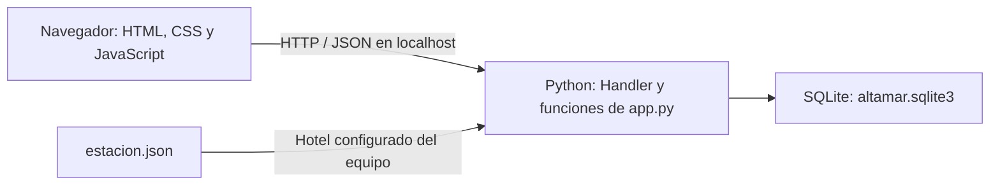
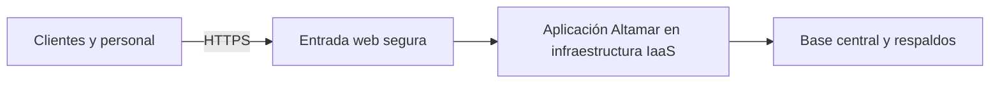

# Arquitectura y tendencias - explicación simple

## Lo que funciona hoy

Altamar es una aplicación web local con arquitectura cliente-servidor y una base de datos SQLite. La interfaz está en `static/`; `Handler` recibe solicitudes HTTP y las funciones de `app.py` aplican las reglas de negocio. Toda operación de una instancia consulta el mismo archivo `altamar.sqlite3`.

Es un monolito sencillo: interfaz separada en archivos, pero reglas y acceso a datos dentro de `app.py`. No hay microservicios ni un framework adicional.

La configuración de estación representa el hotel del equipo; **no utiliza GPS**. Si no hay una configuración válida, la implementación permite a recepción operar sobre la cadena y lo advierte. Para la exposición, mantener un hotel válido en `estacion.json`.

## SaaS, IaaS y Cloud en este proyecto

| Concepto | Significado | Aplicación a Altamar |
|---|---|---|
| SaaS | Aplicación ofrecida al usuario como servicio sobre infraestructura cloud. | Modelo propuesto: clientes y empleados entrarían desde el navegador a un Altamar administrado centralmente. |
| IaaS | Recursos de infraestructura, como máquinas virtuales, almacenamiento y redes. | Opción para alojar el servidor: el equipo administraría el sistema operativo y la aplicación. |
| Cloud Computing | Recursos compartidos bajo demanda con elasticidad y medición del uso, entre otras características. | Permitiría hospedar el servicio y ajustar recursos; esto todavía no está implementado. |

SaaS describe cómo se ofrece la aplicación; IaaS describe una posible infraestructura que la soporta. Pueden combinarse. La definición se basa en [NIST SP 800-145](https://csrc.nist.gov/pubs/sp/800/145/final).

**Respuesta para RNF-01:** «Hoy operamos localmente, con cliente-servidor y SQLite. El modelo de entrega propuesto es SaaS; una máquina virtual IaaS podría alojarlo. La demostración no está desplegada en la nube».

## Propuesta futura, no implementada

Para realizar esa propuesta habría que adaptar el servidor local para producción, configurar HTTPS y los hosts permitidos, administrar secretos y cuentas, y preparar respaldos y monitoreo. Para varias instancias se necesitaría una estrategia de base central y concurrencia; copiar SQLite a cada hotel produciría bases independientes.

## Por qué esta arquitectura para la demostración

Python y SQLite permiten ejecutar el sistema sin paquetes externos. `BEGIN IMMEDIATE` y la clave única `(hotel_id, room, night)` protegen el inventario. Las pruebas verifican un escenario concurrente limitado; no demuestran 300 usuarios simultáneos, disponibilidad anual ni latencia en una red real.

No se agregan patrones solo para nombrarlos: esta versión usa funciones. No contiene implementaciones explícitas de Singleton, Observer ni un adaptador conectado a facturación heredada. Es una simplificación del diseño inicial que debe explicarse si el docente lo consulta.
