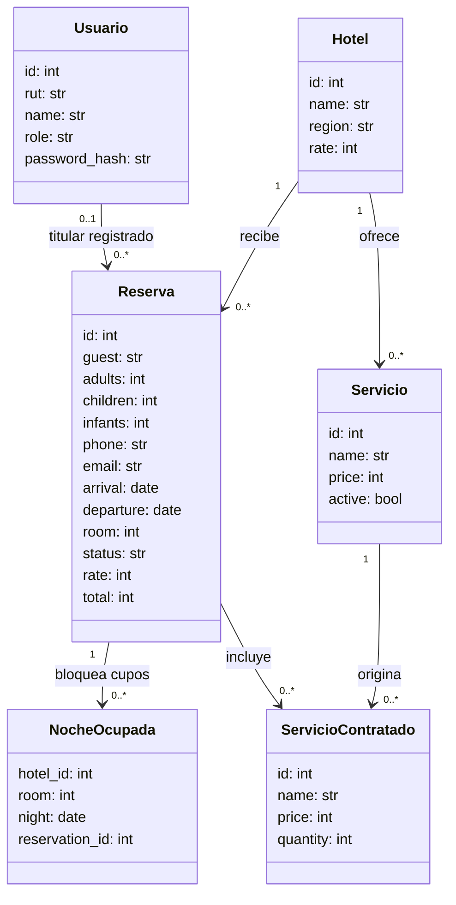
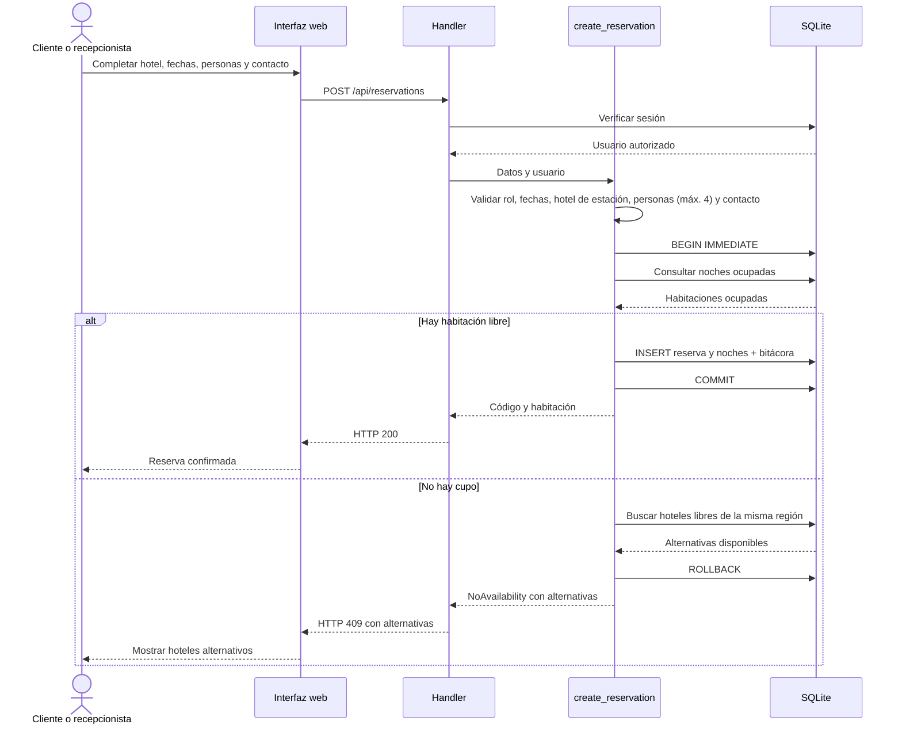
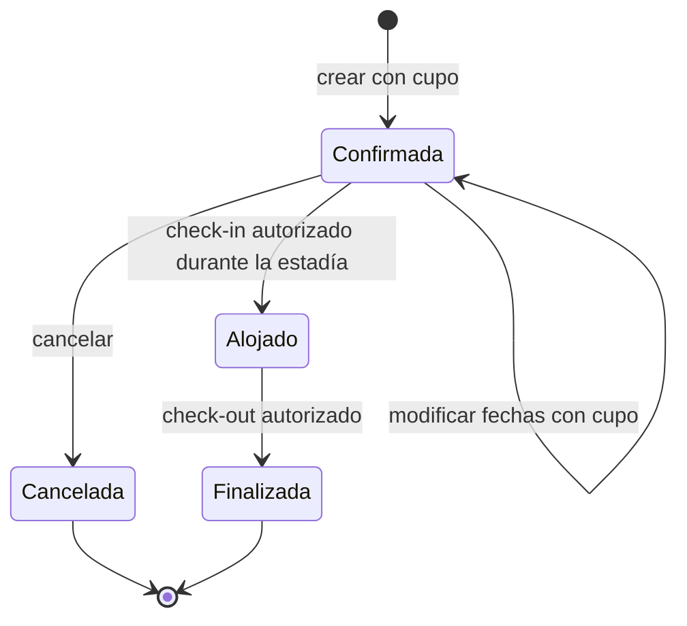

# Diagramas UML - versión simplificada

Diagramas alineados con `Resorts-Altamar-main/app.py`. Se visualizan en GitHub. Los nombres de entidades representan tablas; no afirman que existan clases Python para cada una.

## 1. Estructura: modelo de dominio

Correspondencia: `Usuario=users`, `Hotel=hotels`, `Reserva=reservations`, `NocheOcupada=nights`, `Servicio=services`, `ServicioContratado=reservation_services`. No existe tabla Habitación: `room` identifica una de cinco habitaciones por hotel. `region` es un atributo del hotel. Se omiten sesiones y bitácora para mantener legible el modelo de negocio.

`user_id` admite nulo por compatibilidad con reservas antiguas. En una reserva nueva de huésped sin cuenta, el código asigna como propietario al recepcionista creador. Por eso Usuario no equivale siempre al huésped. El precio se copia en cada contratación para conservarlo aunque cambie el catálogo. `adults`, `children`, `infants`, `phone` y `email` quedan vacíos en reservas creadas antes del 5 de octubre de 2026.

## 2. Interacción: crear reserva sin sobreventa

Funciones: `create_reservation`, `available_room`, `alternative_hotels` y `connection`. La transacción mantiene unidas la consulta y la asignación. Una sugerencia no bloquea el hotel alternativo: la disponibilidad se vuelve a validar al confirmar.

## 3. Comportamiento: estados de una reserva

Cancelar libera las noches. El check-out calcula alojamiento y servicios, guarda el total y libera las noches. Una reserva alojada, cancelada o finalizada no admite modificación de fechas ni cancelación. Solo recepción y gerencia hacen check-in/check-out; el cliente administra sus propias reservas.

## Roles y funciones para explicar los diagramas

| Actor | Operaciones |
|---|---|
| Cliente | Crear y consultar sus reservas, modificar fechas, cancelar y contratar servicios. |
| Recepción | Registrar clientes y gestionar reservas, servicios y entradas/salidas en el hotel configurado. |
| Gerencia | Supervisar la cadena, configurar servicios, gestionar reservas existentes y consultar bitácora. No crea reservas. |

Recepción necesita una estación válida para iniciar sesión y solo opera en ese hotel.
